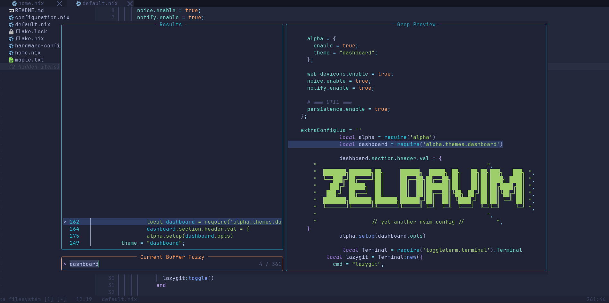
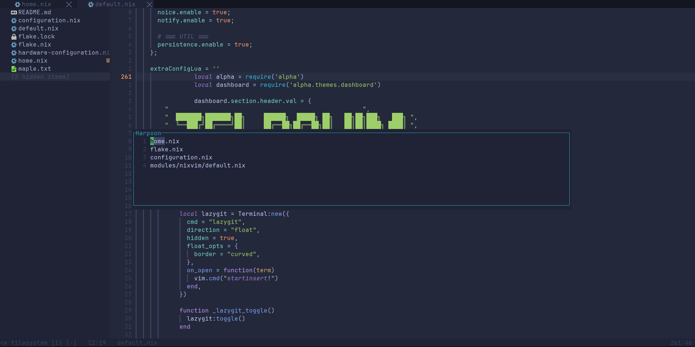
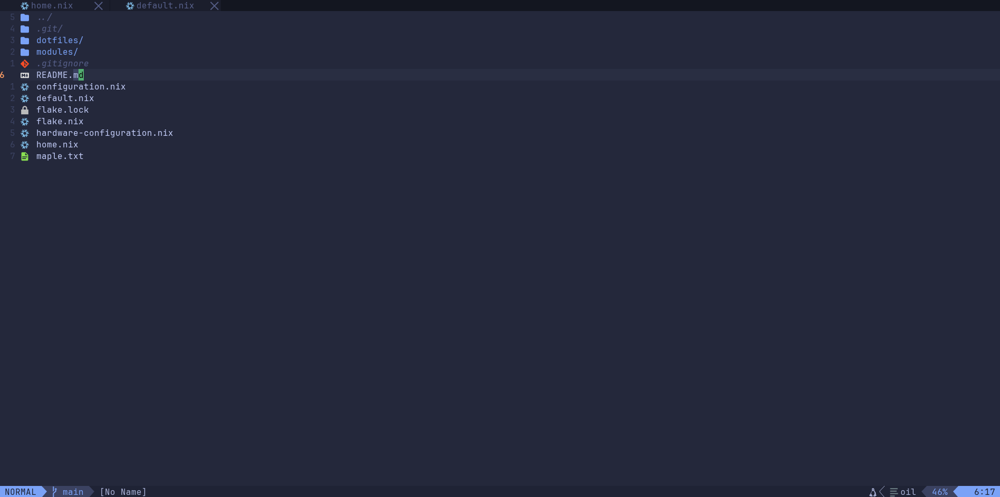

# yet another nvim config

> yes, it's another one. no, you don't need it. yes, you'll probably try it anyway.

> yes, i know this looks unprofessional, i couldn't care less.

## why does this exist?

because i wanted harpoon, oil, and everything declared in nix. 
that's it. that's the pitch.

## what makes this different?

probably nothing! but it's:
- ✅ fully reproducible (it's nix)
- ✅ actually my daily driver 
- ✅ not trying to be an IDE
- ✅ honest about what it is

## showcase

### Telescope + Fuzzy Finding

### Harpoon Quick Menu

### Oil.nvim

## installation

it's a flake. you know what to do.
